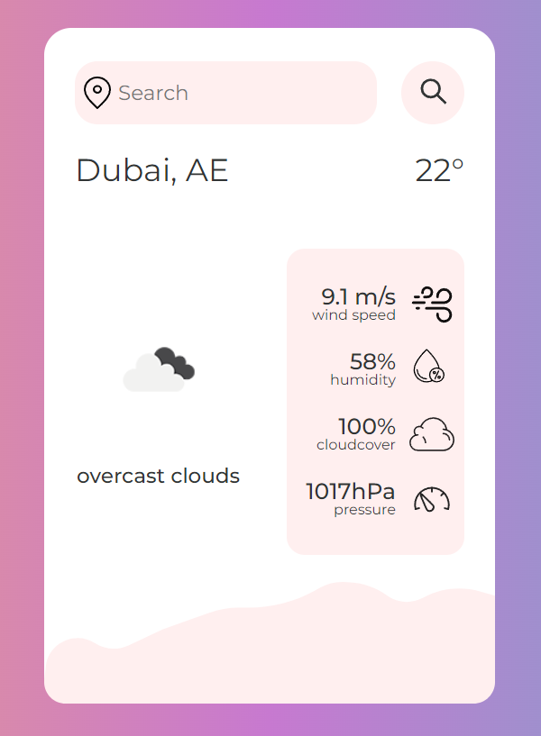

# Weather App

***

## About the App
The weather application allows users to get information about the current weather for various locations. It provides users with data on temperature, wind speed, humidity, cloud cover, and pressure.

## Key Features
1. **Display Current Weather:** Users can see the temperature, wind speed, and other meteorological data for the selected location.
2. **Weather Condition Icons:** The app shows an icon reflecting the current weather conditions.
3. **Detailed Information:** Additional information about humidity, cloud cover, and pressure is presented in a list format with icons for easy understanding.

## Screenshot 

